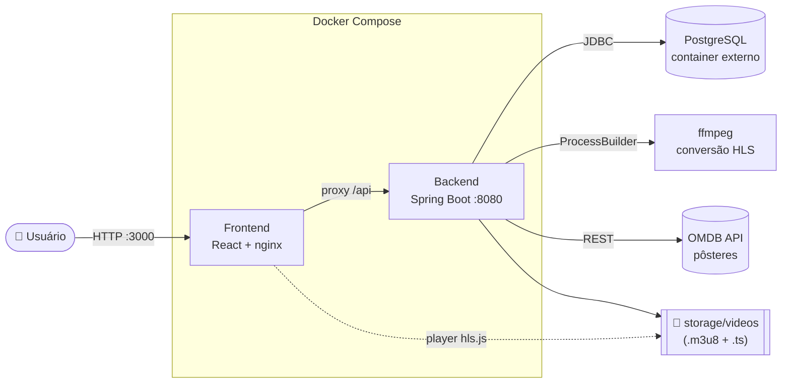
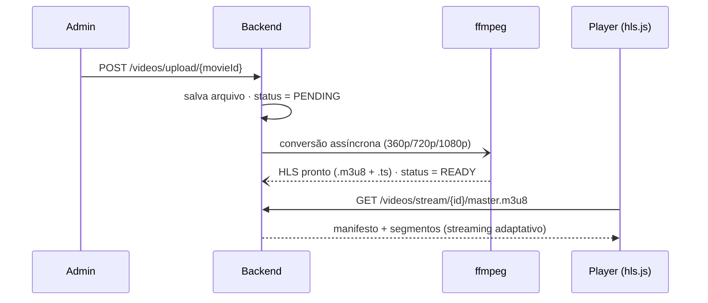

<div align="center">

# 🎬 LOCFLIX

### Plataforma de streaming estilo Netflix — **100% local**, com streaming real de vídeo

Catálogo de filmes, autenticação JWT, locações, favoritos e **streaming HLS** sob demanda.
Monorepo com **API Spring Boot** + **SPA React/TypeScript**, tudo orquestrado por **Docker Compose**.

<br/>


[](https://github.com/josewilson/LocFlix/actions/workflows/ci.yml)


</div>

---

## 📑 Sumário

- [✨ Funcionalidades](#-funcionalidades)
- [🏛️ Arquitetura](#️-arquitetura)
- [🧱 Stack](#-stack)
- [🚀 Início rápido (Docker)](#-início-rápido-docker)
- [🔑 Variáveis de ambiente](#-variáveis-de-ambiente)
- [🧑‍💻 Execução manual](#-execução-manual)
- [🎞️ Como funciona o streaming](#️-como-funciona-o-streaming)
- [🧪 Qualidade & CI](#-qualidade--ci)
- [🗂️ Estrutura do projeto](#️-estrutura-do-projeto)
- [🗺️ Roadmap](#️-roadmap)
- [📝 Licença](#-licença)

---

## ✨ Funcionalidades

| | |
|---|---|
| 🔐 **Autenticação JWT** | Login/registro, papéis `ADMIN`/`USER` e rotas protegidas |
| 🏠 **Interface Netflix** | Hero Banner, carrosséis por categoria, *hover cards* e *skeleton loading* |
| 🎞️ **Catálogo rico** | Busca, filtros, paginação, página de detalhes e **pôsteres reais** (OMDB) |
| ▶️ **Streaming HLS** | Upload → conversão assíncrona com `ffmpeg` → player adaptativo `hls.js` |
| ❤️ **Favoritos & locações** | Aluguel por período com regra de acesso ao player |
| 🛠️ **Painel Admin** | Cadastro de filmes/categorias e upload de vídeos |
| 📖 **API documentada** | Swagger/OpenAPI 3 pronto para explorar |
| 🐳 **Um comando** | `docker compose up` sobe a stack inteira |

---

## 🏛️ Arquitetura



**Camadas do backend:** `Controller → Service → Repository → DB`, com DTOs, `ModelMapper`,
tratamento global de exceções e migrations versionadas pelo **Flyway** (V1–V6).

---

## 🧱 Stack

<table>
<tr><td><b>Backend</b></td><td>

`Java 21` · `Spring Boot 3.5` · `Spring Security` · `JPA/Hibernate` · `Flyway` · `JWT (HS512)` · `springdoc/Swagger`

</td></tr>
<tr><td><b>Streaming</b></td><td>

`ffmpeg` · `HLS` (`.m3u8` + segmentos `.ts`) · processamento assíncrono (`@EnableAsync`)

</td></tr>
<tr><td><b>Frontend</b></td><td>

`React 18` · `Vite` · `TypeScript` · `TanStack Query` · `React Router` · `hls.js` · `Zod` + `React Hook Form`

</td></tr>
<tr><td><b>Infra</b></td><td>

`Docker Compose` · `nginx` (SPA + proxy) · `PostgreSQL` · `GitHub Actions` (CI)

</td></tr>
</table>

---

## 🚀 Início rápido (Docker)

> 💡 O banco **não** é criado pelo compose — ele usa o seu **container PostgreSQL existente**.

```bash
# 1. Crie o banco (uma vez) no seu PostgreSQL
docker exec -e PGPASSWORD=postgres <seu-container-postgres> createdb -U postgres locflix

# 2. Configure o ambiente
cp .env.example .env        # ajuste credenciais, JWT_SECRET e OMDB_API_KEY

# 3. Suba tudo
docker compose up --build
```

| Serviço  | URL | Observação |
|----------|-----|------------|
| 🖥️ **Frontend** | http://localhost:3000 | Interface principal |
| ⚙️ **API**      | http://localhost:8080 | REST |
| 📖 **Swagger**  | http://localhost:8080/swagger-ui.html | Documentação interativa |

> 🔓 **Acesso admin:** definido por você em `ADMIN_EMAIL` / `ADMIN_PASSWORD` no `.env`.
> O Flyway cria o schema e um catálogo de **30 filmes** com pôsteres reais automaticamente.

---

## 🔑 Variáveis de ambiente

Definidas no `.env` (veja `.env.example`):

| Variável | Descrição | Padrão |
|----------|-----------|--------|
| `DB_URL` | JDBC do PostgreSQL externo | `jdbc:postgresql://host.docker.internal:5432/locflix` |
| `DB_USERNAME` / `DB_PASSWORD` | Credenciais do banco | `postgres` / `postgres` |
| `JWT_SECRET` | Segredo do token (≥ 256 bits) | *troque em produção* |
| `APP_CORS_ALLOWED_ORIGINS` | Origens liberadas no CORS | `http://localhost:3000` |
| `OMDB_API_KEY` | Chave para pôsteres reais ([grátis](https://www.omdbapi.com/apikey.aspx)) | *(vazio → capa SVG)* |
| `ADMIN_EMAIL` / `ADMIN_PASSWORD` | Admin inicial (bootstrap) — defina os seus | *(vazio → admin não criado)* |

---

## 🧑‍💻 Execução manual

<details>
<summary>Rodar sem Docker (requer Java 21, Node.js e ffmpeg no <code>PATH</code>)</summary>

```bash
# Backend
cd backend
./mvnw spring-boot:run

# Frontend (em outro terminal)
cd frontend
npm install
npm run dev
```

</details>

---

## 🎞️ Como funciona o streaming



O acesso ao player exige uma **locação ativa** do filme.

---

## 🧪 Qualidade & CI

O workflow `.github/workflows/ci.yml` roda a cada push/PR:

- 🟢 **Backend** — `mvn verify` (compila e testa, Java 21)
- 🟢 **Frontend** — `npm ci` → `lint` → `test:run` → `build`

```bash
# localmente
cd frontend && npm run lint && npm run test:run && npm run build
```

---

## 🗂️ Estrutura do projeto

```
LOCFLIX/
├─ backend/             API Spring Boot · migrations Flyway · Dockerfile
│  └─ src/main/java/com/locflix/   controllers · services · repositories · entities
├─ frontend/            SPA React/Vite · nginx (Dockerfile + nginx.conf)
│  └─ src/              pages · shared/components · hooks · api
├─ docker-compose.yml   Orquestra backend + frontend (banco é externo)
└─ .env.example         Variáveis de ambiente
```

---

## 🗺️ Roadmap

- [x] **Fase 1** — Infraestrutura base (JWT, JPA, 27 endpoints)
- [x] **Fase 2** — Arquitetura em camadas + frontend base
- [x] **Fase 3** — Streaming de vídeo (HLS backend + player)
- [x] **Fase 4** — Interface Netflix (hero, carrosséis, detalhes, responsivo)
- [x] **Fase 5** — Docker Compose completo
- [x] **Fase 6** — Polimento, seed com imagens reais, CI e documentação

---

## 📝 Licença

Projeto desenvolvido para fins **acadêmicos** (UNIESP — Sistemas para Internet).
Distribuído sob a licença **MIT** — sinta-se livre para estudar e adaptar.

<div align="center">

---

Feito com ☕ e 🎬 — **LOCFLIX**

</div>
